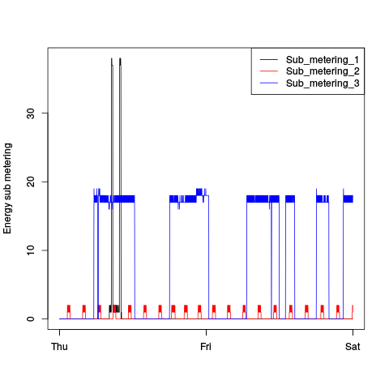
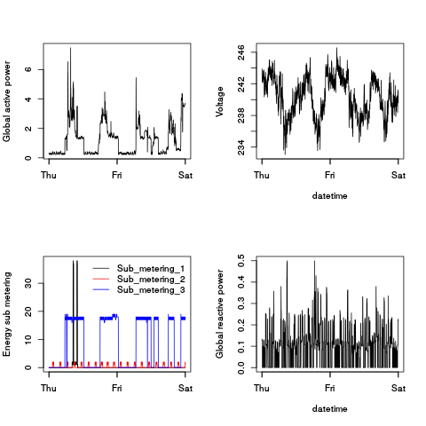

## Introduction

This is the repository of first assignment of "Exploratory Data Analysis" on Coursera

Data info:
--------------
* **Source**: data used for this work obtained from
the <a href="http://archive.ics.uci.edu/ml/">UC Irvine Machine
Learning Repository</a>. 

* **Dataset**: corresponds to "Individual household electric power consumption Data Set" which are available on
[here](http://archive.ics.uci.edu/ml/machine-learning-databases/00235/household_power_consumption.zip) and sizes 20mb.

* **Description** (taken from [UCI web site](https://archive.ics.uci.edu/ml/datasets/Individual+household+electric+power+consumption)): Measurements of electric power consumption in one household with a one-minute sampling rate over a period of almost 4 years. Different electrical quantities and some sub-metering values are available. 

* **Data info** (taken from [UCI web site](https://archive.ics.uci.edu/ml/datasets/Individual+household+electric+power+consumption)):
 - Archive contains 2075259 measurements of 47 months gathered between December 2006 and November 2010.
 - Dataset contains some missing values in the measurements (nearly 1,25% of the rows). A missing value is represented by the absence of value between two consecutive semi-colon attribute separators. For instance, the dataset shows missing values on April 28, 2007.
 - Dataset contains following 9 variables.
    - **Date**: Date in format dd/mm/yyyy
    - **Time**: Time in format hh:mm:ss
    - **Global_active_power**: household global minute-averaged active power (in kilowatt)
    - **Global_reactive_power**: household global minute-averaged active power (in kilowatt)**
    - **Voltage**: minute-averaged voltage (in volt)
    - **Global_intensity**: household global minute-averaged current intensity (in ampere)
    - **Sub_mastering_1**: energy sub-metering No. 1 (in watt-hour of active energy). It corresponds to the kitchen, containing mainly a dishwasher, an oven and a microwave (hot plates are not electric but gas powered).
    - **Sub_mastering_2**: energy sub-metering No. 2 (in watt-hour of active energy). It corresponds to the laundry room, containing a washing-machine, a tumble-drier, a refrigerator and a light..
    - **Sub_mastering_3**: energy sub-metering No. 3 (in watt-hour of active energy). It corresponds to an electric water-heater and an air-conditioner..

Repository Info
------------------

The repository containts following files:
  - **`README.md`**: descriptive readme file.
  - **`hcp_feb_07_0102.txt`**: Data file corresponding to 2007/02/01-2007/02/02 subset from "Individual household electric power consumption Data Set"
  - **`plot1.R`**; **`plot2.R`**; **`plot3.R`**; **`plot4.R`**: R codes that process "hcp_feb_07_0102.txt" file in order to generate the respective output plots.
  - **`plot1.png`**; **`plot2.png`**; **`plot3.png`**; **`plot4.png`**: output plots grenerated by **`plot1.R`**; **`plot2.R`**; **`plot3.R`** and **`plot4.R`**, from `hcp_feb_07_0102.txt` subset, which are shown below

    - Plot 1
    
       

    - Plot 2
    
       

    - Plot 3
    
       

    - Plot 4
    
      

